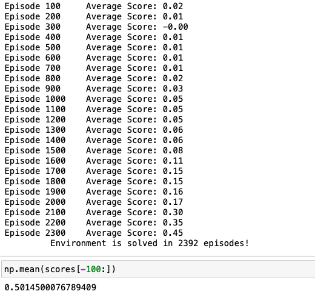
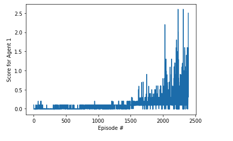
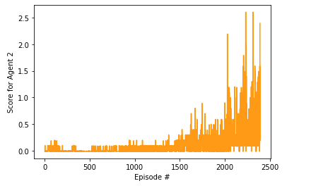

# Tennis - Multi Agent
This project repository is created to show my solution for Udacity's [Deep Reinforcement Learning Nanodegree](https://www.udacity.com/course/deep-reinforcement-learning-nanodegree--nd893)
Project 3: Collaboration and Competition.

## Environment


In this environment, two agents control rackets to bounce a ball over a net. If an agent hits the ball over the net, it receives a reward of +0.1. If an agent lets a ball hit the ground or hits the ball out of bounds, it receives a reward of -0.01. Thus, the goal of each agent is to keep the ball in play.

The observation space consists of 8 variables corresponding to the position and velocity of the ball and racket. Actually, 8 variables for each time step, and 3 stacked time steps, so our state space consist of 24 varaibles. Each agent receives its own, local observation. Two continuous actions are available, corresponding to movement toward (or away from) the net, and jumping.

The task is episodic, and in order to solve the environment, your agents must get an average score of +0.5 (over 100 consecutive episodes, after taking the maximum over both agents). Specifically,

After each episode, we add up the rewards that each agent received (without discounting), to get a score for each agent. This yields 2 (potentially different) scores. We then take the maximum of these 2 scores.
This yields a single score for each episode.
The environment is considered solved, when the average (over 100 episodes) of those scores is at least +0.5.

## Getting Started
- First of all you need to configure a Python 3.6 environment with the needed requirements as described in below:
1. Create (and activate) a new environment with Python 3.6.

	- __Linux__ or __Mac__: 
	```bash
	conda create --name drlnd python=3.6
	source activate drlnd
	```
	- __Windows__: 
	```bash
	conda create --name drlnd python=3.6 
	activate drlnd
	```
	
2. Follow the instructions in [this repository](https://github.com/openai/gym) to perform a minimal install of OpenAI gym.  
	- Next, install the **classic control** environment group by following the instructions [here](https://github.com/openai/gym#classic-control).
	- Then, install the **box2d** environment group by following the instructions [here](https://github.com/openai/gym#box2d).
	
3. Clone the repository (if you haven't already!), and navigate to the `python/` folder.  Then, install several dependencies.
```bash
git clone https://github.com/udacity/deep-reinforcement-learning.git
cd deep-reinforcement-learning/python
pip install .
```

4. Create an [IPython kernel](http://ipython.readthedocs.io/en/stable/install/kernel_install.html) for the `drlnd` environment.  
```bash
python -m ipykernel install --user --name drlnd --display-name "drlnd"
```

5. Before running code in a notebook, change the kernel to match the `drlnd` environment by using the drop-down `Kernel` menu. 
- Clone this project and make it accesible in your Python environment
- Then you have to install the Unity environment as described in the below:
    - Download the environment that matches your operating system:
        - Linux: [click here](https://s3-us-west-1.amazonaws.com/udacity-drlnd/P1/Banana/Banana_Linux.zip)
        - Mac OSX: [click here](https://s3-us-west-1.amazonaws.com/udacity-drlnd/P1/Banana/Banana.app.zip)
        - Windows (32-bit): [click here](https://s3-us-west-1.amazonaws.com/udacity-drlnd/P1/Banana/Banana_Windows_x86.zip)
        - Windows (64-bit): [click here](https://s3-us-west-1.amazonaws.com/udacity-drlnd/P1/Banana/Banana_Windows_x86_64.zip)
        
       Then, place the file in the ```environments/``` folder
       
## Report
### Algorithm
The agent is trained by using one of the Actor-Critic methods: Deep Deterministic Policy Gradient (DDPG) algorithm. The deep neural network has following layers:
```bash
  Actor
  
    - Fully Connected Layers (input: 48, output: 256)
    - Fully Connected Layers (input: 256, output: 128)
    - Fully Connected Layers (input: 128, output: 8)
    
  Critic
  
    - Fully Connected Layers (input: 64, output: 256)
    - Fully Connected Layers (input: 256, output: 128)
    - Fully Connected Layers (input: 128, output: 1)
```
```bash
Parameters:
 
    - Gamma: 0.99
    - Actor Alpha (Learning Rate): 0.001
    - Critic Alpha (Learning Rate): 0.001
    - Epsilon: 1.0
    - Epsilon Decay: 1e-6
    - Replay Buffer Size: 100000
    - Batch Size: 256
    - Update Every: 4
```   
### Results




### Future Works
```bash
- PPO
- A2C
- A3C
- Train to get better optimum score by using best model according to experiences
```
